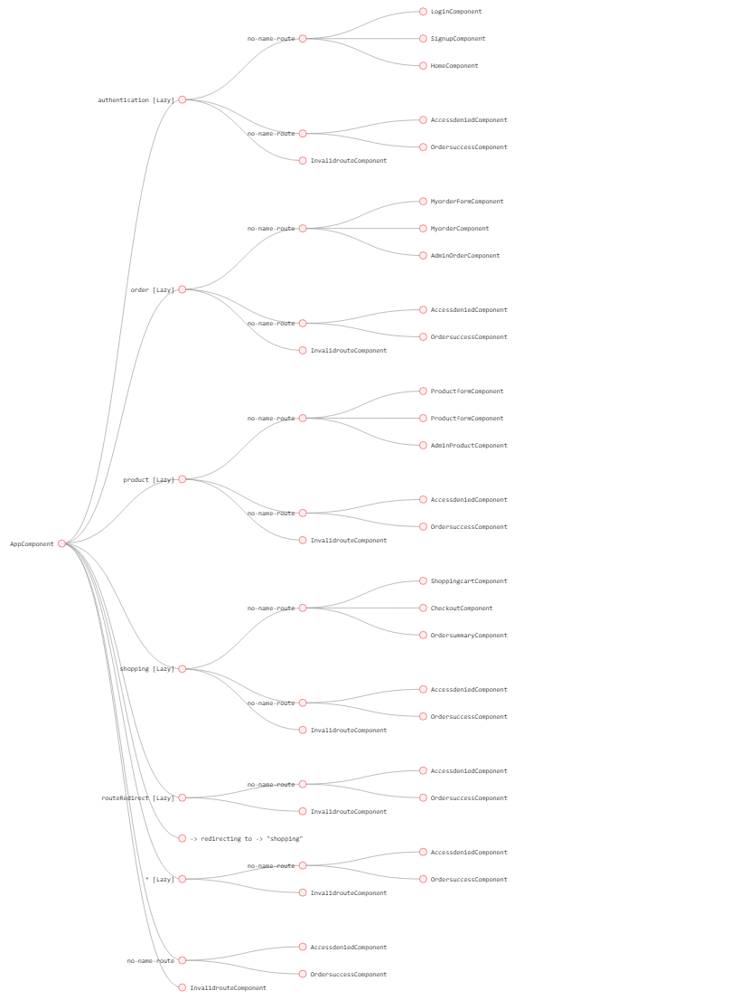

## Online-Bookshelf (front-end Angular application)

This is a ecommerce application build on [Angular CLI](https://github.com/angular/angular-cli) version 8.3.20.

## Out-Line of the Project
Application is designed for a `normal user` and the `Admin user`.  

Admin user can modify the shopping list products and can manage all the orders(`this route is in development stage currently`).  

A normal user can place order and can view his past and current orders in his order list.  

-> New user can register under sign-up route with membership details(`prime or non-prime`).  

-> Every user should have a unique ID used to login, here we are checking for the duplicates in data-base before user sign-up, this helps to avoids duplicates user login ID's in database.  

->LoggedIn user can add products to his cart and place order and can also delete the order if required.  

## Route Protection and Lazy Loading 
 
Implemented Route protection from the un-authorized user, in this project the admin can only edit the product & orders. So authguard is used on this routes where non-admin user cant access this route.

Lazy loading is used for the bettter efficiency and reduce load time, since by default angular is a eagarly loaded its cost much while application grows the size.

Below is the feature modules that are loaded lazily(`debugged using Augury`)

