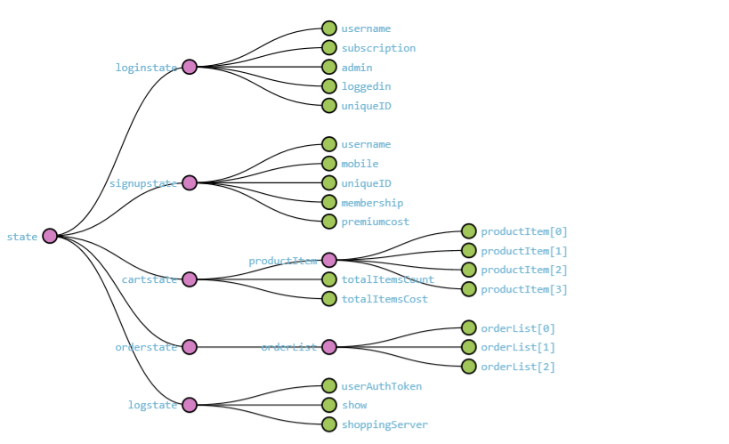

## Online-Bookshelf (front-end Angular application)

This is a ecommerce application build on [Angular CLI](https://github.com/angular/angular-cli) version 8.3.20.  

▶ Deployed on `Heroku`, project is live on this [link](https://online-bookshelf.herokuapp.com/)  

▶ Backend is deployed on `Heroku`, API is live on this [link](https://online-book-shelf.herokuapp.com/)  

▶ Souce code for `NodeJS backend` is available at [ecommerce_serverside_dev](https://github.com/rajachinth/ecommerce_serverside_dev)  

## Out-Line of the Project
Application is designed for a `normal user` and the `Admin user`.  

● Admin user can modify the shopping list products and can manage all the orders(`this route is in development stage currently`).  

● A normal user can place order and can view his past and current orders in his order list.  

● New user can register under sign-up route with membership details(`prime or non-prime`).  

● Every user should have a unique ID used to login, here we are checking for the duplicates in data-base before user sign-up, this helps to avoids duplicates user login ID's in database.  

● LoggedIn user can add products to his cart and place order and can also delete the order if required.  

## Route Protection and Lazy Loading 
 
Implemented Route protection from the un-authorized user, in this project the admin can only edit the product & orders. So authguard is used on this routes where non-admin user cant access this route.

Lazy loading is used for the bettter efficiency and reduce load time, since by default angular is a eagarly loaded its cost much while application grows the size.

Below is the feature modules that are loaded lazily(`debugged using Augury`)  

## Redux State Management

Used Redux state management for having a singleton store for managing all the components behaviour. Check the source code for the detailed break-down of the logic written for this ecommerce apllication.  

In Redux, the three main building blocks are:  
1.store, 2. action, 3.reducer  

 **1.store:**  
 It's a single JS object that contains the state of the application  
 
 ->here one single state can be accessed by various components.  
    
 **2.actions:**  
    It's a plain JS object that represents something that has happened in applications.  
    In Redux, actions are more like "events"  

 **3.reducer:**  
 It's function that specifies how the state changes in response with actions  
 
 ->Here, reducer doesnt change/modify the original state, it duplicates and changes/modify 
 the state but not on original.  
 
 ->reducers are & should be pure function(i.e., it gives same output as input) and shouldnt 
 have side-effects(i.e., when we make any backend calls the state of our application that 
 stored in DB gonna change)  

 ->Input and output should be same and shouldnt change original state becacuse it has own advantages  
        1.easily testable  
        2.time travel debugging  
        
**Here, we should follow the "pure Function" principle becacuse,
  if we update the current state of the object, the when we use redux development extension
  tool to check the data flow of the state transitions, we can observe both previous and current
  state values would be same. And there is not point to implement REDUX with this ambiquity and 
  typical to mentain since all state transitions have overlapped data.**  
  
  That why should follow **Pure Function** principles.  
  
Below is the Redux State Management graph(`debugged using NgRedux debugging Tool`)  

## Angular Animations

Used built-in angular animation library which is build on top of the `web animation API`.  

Angular has module "angular/anmations" build on top of standard "web animation API", so it directly work on
this angular abstract methods derived from `"web animation API"`.  

**use polyfil code to run modern JS code/modules in old browsers
         go to polyfil.ts and uncomment the code-lines required and install 
         that mentioned package using NPM or any other external modules**

state 1 -------`transistion`-------> state 2  

**Angular has 3 different states**  

1.Void  
2.Default(*) or wildcard state  
3.Custom  

**Void state**: In this state the elements are not part of DOM  

   **ex**: when we add elements to the DOM then, void state of elements --------> default(*) state of elements  
    
**Default state**: In this state element are present in the DOM   

   **ex**: when we remove elements from the DOM then, default state of element------->void state of element  
    
**Custom state**: In this state, we change the outlook of the DOM element  

   **ex**: on clicking the "address" button this button expands to display address and again when we clicking
    on this again it collapse. Here we changing default/void state--->custome state  
    
**CODE-1**   

 trigger('fade',[
      state('void',style({backgroundColor:'red',opacity:0})),
      state('*',style({backgroundColor:'white',opacity:1})),
      transition('void => *',[
      animate(2000)
    ]),
    transition('* => void',[
      animate(2000) 
    ])
  ])]
})  

**CODE-2**  

trigger('<triggername>',[
    state('<state_name>',style({<styles>})),
    transistion('void => *',[
        style();
        animation(<animation duration>,style())
    ])
])  

**CODE-3**  

 trigger('fade',[
      state('void',style({backgroundColor:'red',opacity:0})),
      state('*',style({backgroundColor:'white',opacity:1})),
      transition(':enter,:leave',[animate(2000)]),
])]  
  
## Angular Material & Bootsrap

Angular material is a library of high-quality UI component build on Angular and Typescript.  

->In parallel Bootstrap is also there for UI components design and outlook, but its purely build on plain 
Javascript and to use this in Angular, should create custom directives are third-party libraries
i.e., its consists lot of dependecies on angular, which can easily break with any sort of changes in 
these dependencies in near future.  

->Angular material is purely for for Angular applications, build by google.  

->Angular material may not contain all features that Bootstrap provides, so to build complex UI 
application Bootstrap can also be used along with angular material.  

## CSS & SASS (syntatically awesome style sheet)  

CSS doesnt support many modern features, so often developers write code that doesnt consists
thst features in traditional CSS; here Developers uses preprocessors to compile future CSS to
traditional CSS includes SASS,LESS,STYLUS etc.,   

Its as similar to TypeScript that containd additional features over Javascript and typescript compiler
compiles that to JS file. `ANGULAR by-default uses SASS`.  

In SASS, MIXIN() consists of other style attributes or other MIXIN's that can be 
used or implemented within MIXIN and can be "INCLUDED".  

## Unit and Integration Testing

Writing Automated Test Cases involves additional time-frame and development cost.  
In few projects, there exist a dedicated testing team who are responsible for testing,
but in some projects there exist only development team who ae responsible for both.  

->It again depends on the time-frame and capital invested by client to make a real world 
application with better solution. If you fall under this, there exist no point to develop
automated test cases for half of the project time-frame; it's meaningless.  

->In few project requirements changes so often, and here writing automated test-cases would be 
other pay-load for development to maintain both production code and test code. In this aspect,
its better to write automated test cases for a few which takes huge time for manual testing.  

->It again depends on the project requirements, time-frame, capital to decide whether to write 
100% code coverage automated test cases for production code or **not**.

`Jasmin/Jest be used as they are mostly similar in code signature.`**(my personal choice)**
  
